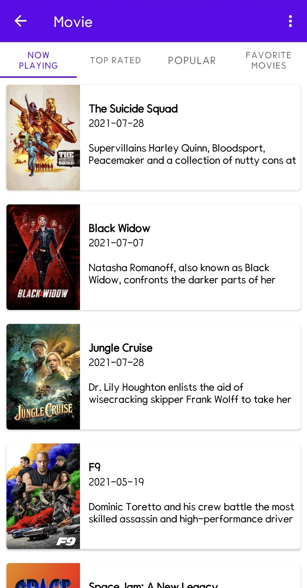
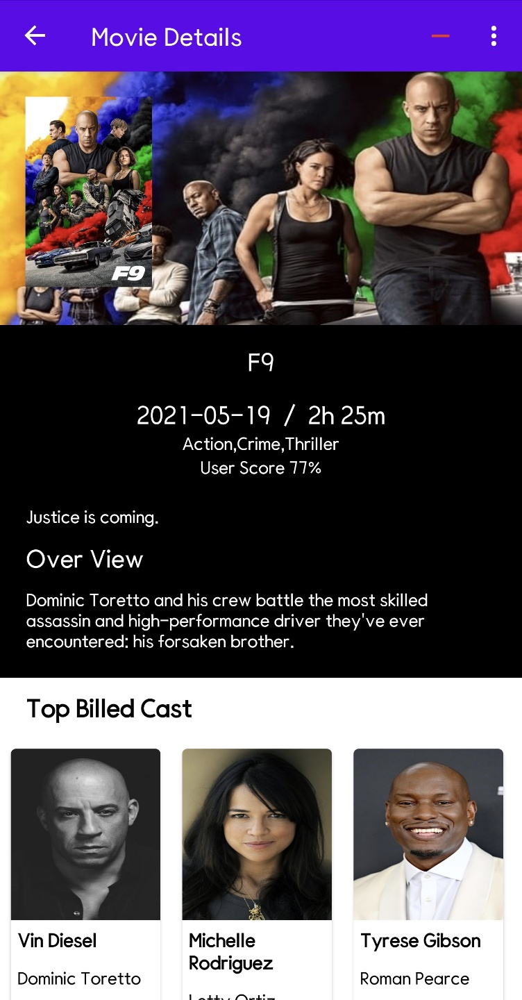
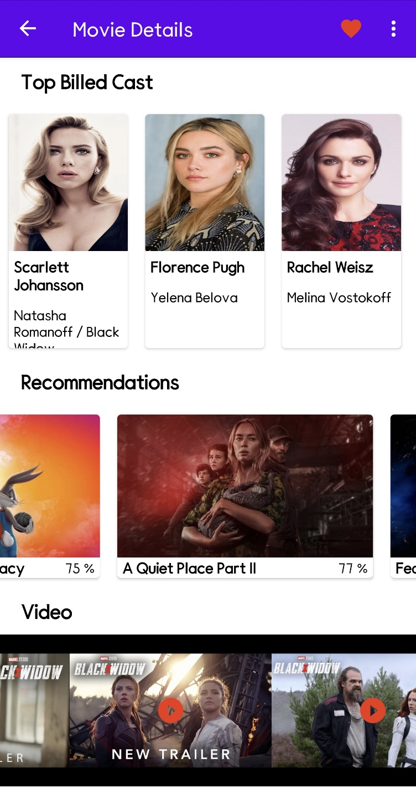
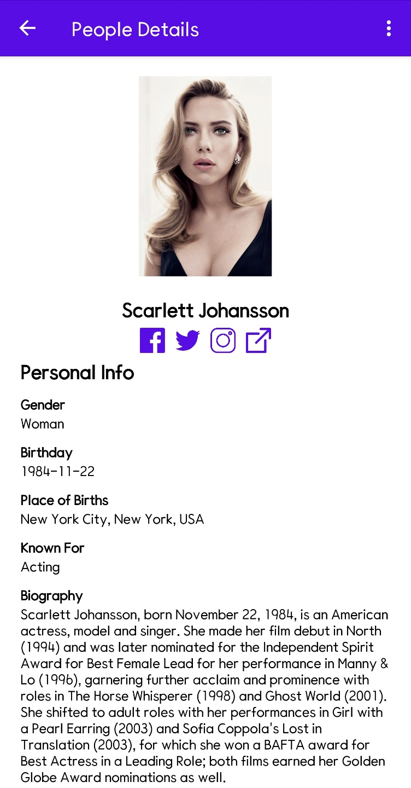

# movieviewer

# 개요
프로젝트는 https://www.themoviedb.org/ 에서 API를 이용하여 정보를 가져 옵니다.

프로젝트는 MVVM, AAC, Clean Architecture 구조를 따릅니다
Core, Feature Module 분리되어 있습니다.
 

# 프로젝트 구조 

## Core
- Common
- data
- database
- datastore
- model
- ui

## feature
- details
- favorites
- movielist
- people

# 사용 라이브러리 

## Jetpack 라이브러리 
- **Compose**
- **Navigation**
- **Hilt** 
- **Paging3** 
- **Room** 

## 오픈소스 라이브러리
- **Coil** : 이미지를 다운로드하고 캐쉬 하기 위해서 사용 
- **Retrofit2** : Open Api를 사용하여 데이터를 얻기 위해서 사용.

